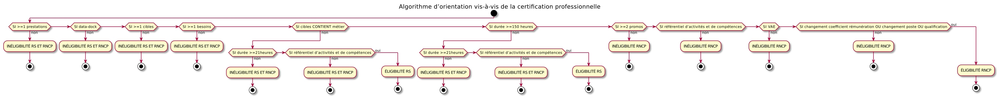

# DiagCertif

## Un outil de diagnostic de faisabilité sur la certification professionnelle

DiagCertif est un outil d'aide à la décision commandé par EssKa Consultants à MAISON MÈRE. Il est réalisé en Python avec le framework [Flask](https://github.com/pallets/flask) et déployé avec [Dokku](https://github.com/dokku/dokku).

### Diagramme de l'algorithme d'orientation

Réalisé grâce à [PlantUML](https://github.com/plantuml/plantuml)

## Remerciement

Merci à EssKa Consultants de m'avoir autorisé à rendre le code open source :zap:
